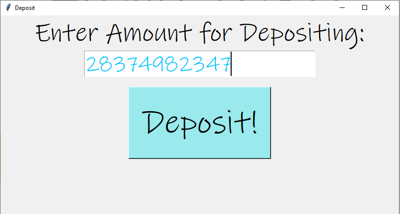

# ATM-Bank-App

https://user-images.githubusercontent.com/104532194/177214696-af8976c6-7182-49dc-889e-c51eade094b4.mp4

# Table of contents
1. [Screenshots](#screenshots)
2. [About](#about)
    * [Built With](#builtwith)
3. [Getting Started](#gettingstarted)
    * [Installation](#installation) 

## Images 

### Figure 1: Login Page

# About 
This project is a login and banking system using Python Tkinter module. 

## Login System
When you run the program, the first thing that pops up is a login window, asking for your username and password, which is saved in a csv file. If you don't already have an account, you can click the sign up button and it will automatically add your username, password, and amount (defult is 0) to the csv file. 

## Main Bank System
After you have successfully logged in to your account, the main bank window will pop up on your screen. This window includes your account username, amount, and 2 buttons: Deposit and Withdraw. When you sign up for an account, your defult amount of money is 0, and once you deposit/withdraw, the amount of money will be updated to your associated row (the amount column). If you press the deposit/withdraw button, it will pop up another window with a text bar, and a button where you can confirm the amount of money to be deposited/withdrawn.

### Figure 2: Account Page

## Built With 
* Python

### Figure 3: Deposit Page

# Getting Started 
**To get this project running follow these steps**

## Installation 
1. Clone the Repository\
`git clone https://github.com/OmPatel5/ATM-Bank-App.git`

2. Install Tkinter\
`pip install tk`

3. Install Pygame\
`pip install pygame`

4. Install Pandas\
`pip install pandas`
