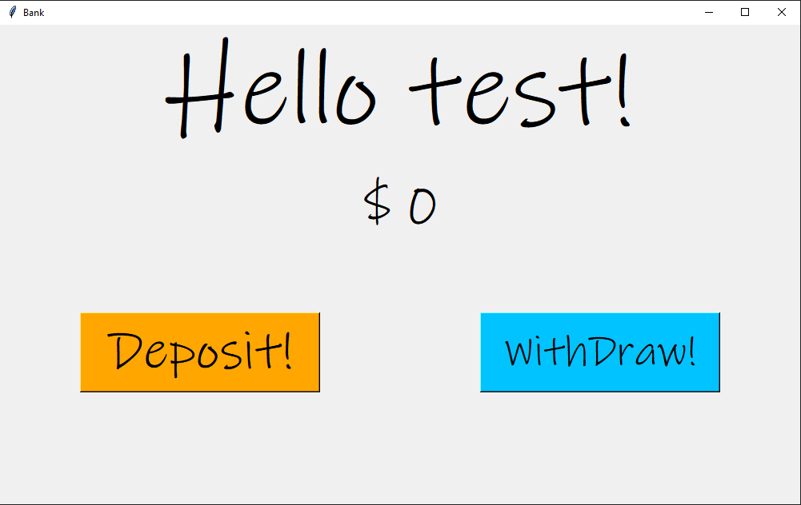

# ATM-Bank-App

# Table of contents
1. [Screenshots](#screenshots)
2. [About](#about)
    * [Built With](#builtwith)
3. [Getting Started](#gettingstarted)
    * [Installation](#installation) 

## Images <a name="screenshots"></a>


### Figure 1: Login Page



### Figure 2: Account Page

# About <a name="about"></a>
about

## Built With <a name="builtwith"></a>
* Python

# Getting Started <a name="gettingstarted"></a>
**To get this project running follow these steps**

## Installation <a name="installation"></a>
1. Clone the Repository
```git clone https://github.com/OmPatel5/ATM-Bank-App.git```
